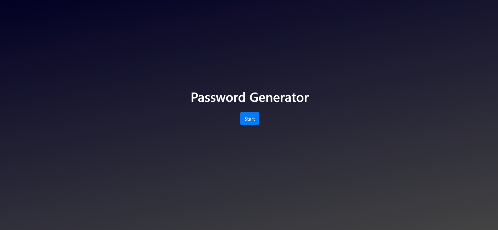

# Password Generator

## Description
This is a useful application to generate a pseudo-random password based on user selected options. Input is strictly controlled through check boxes and sliders to reduce the risk of errors.

## Usage
1. Navigate to https://trojanface.github.io/PasswordGenerator/
2. Follow the onscreen prompt to begin generation.
3. Enter the details of the required password.
4. Generate the password.

## Screenshot

## Contributors
Matthew Teague

